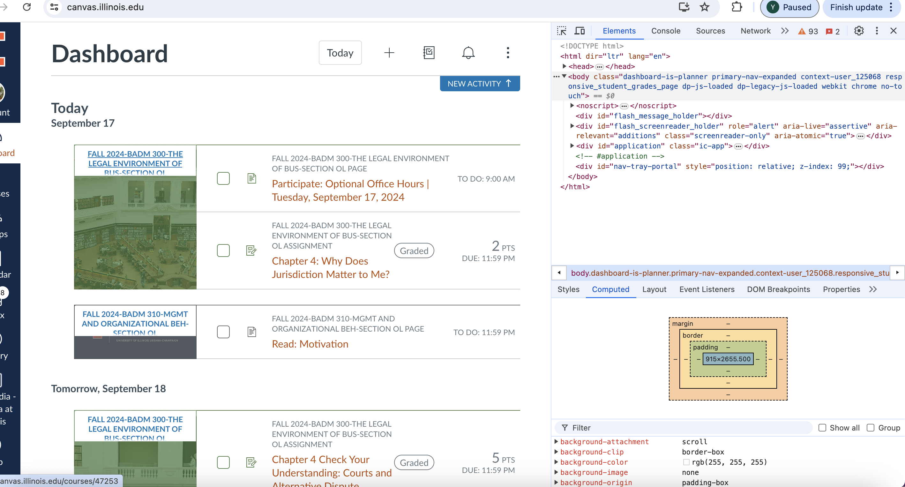
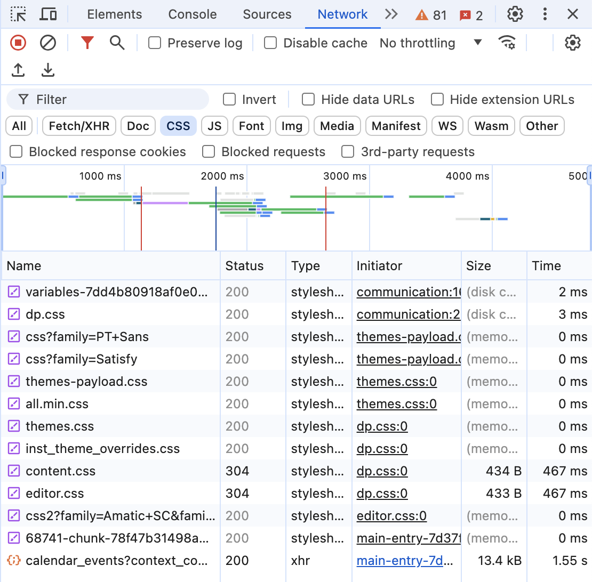
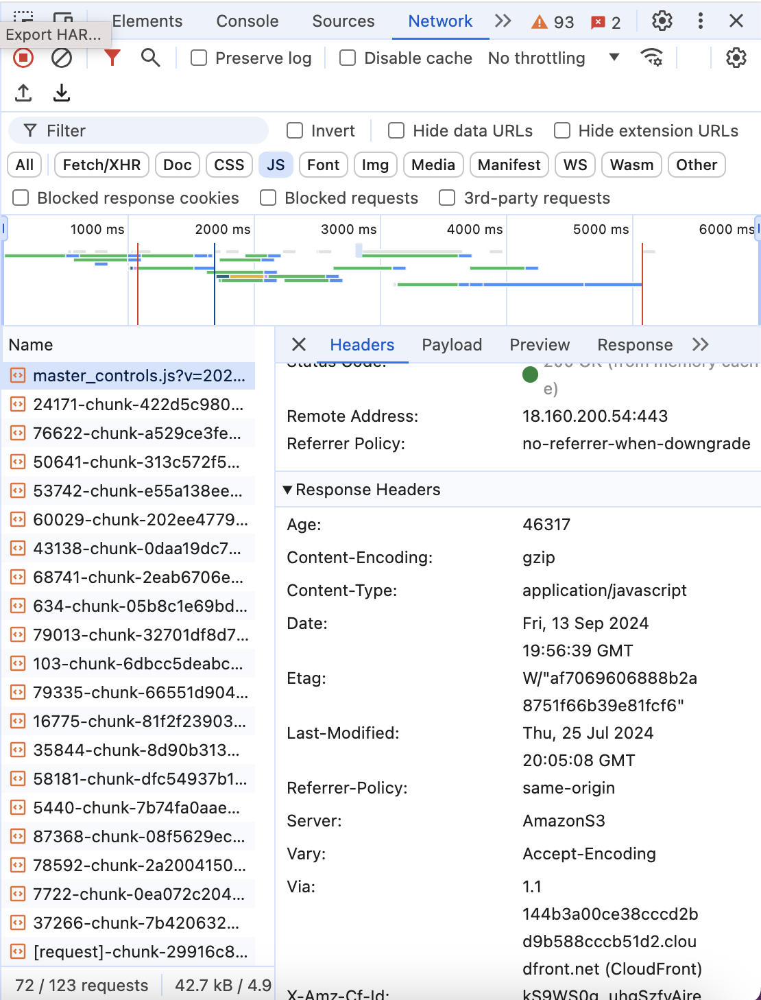

# Inspecting the Web

**Website URL** : http://canvas.illinois.edu 

**What Web Technologies Were Used**
 1 HTML : To build a main structure of the webpage, Canvas mainly used HTML. I was also able to find files ending in .html. 

 2 CSS : I was also able to find few .css files on 'Network' section. These files are used to design website layout, componenets like buttons, menus, and modules. 
 

 3 JavaScript : I was able to find .js files and it seems like javascript is used for dynamic loading and form validation. I also found that React.js is used for the front-end component of the website. 
 4 Other Technology

**Who Built This Website?** 
: A software comapny called "Instructure Holdings, Inc." developed Canvas Platform. Instructure is an educational technology company in United States. Large team of software developers, web designers, and project managers developed canvas. I was unable to find how many people were invovled in developing Canvas. 